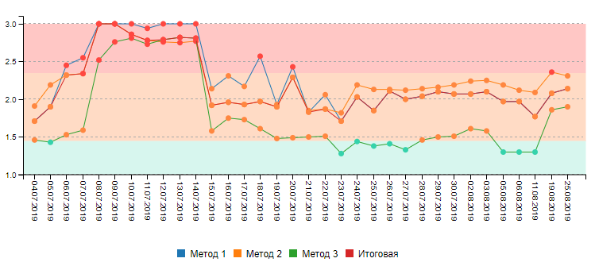
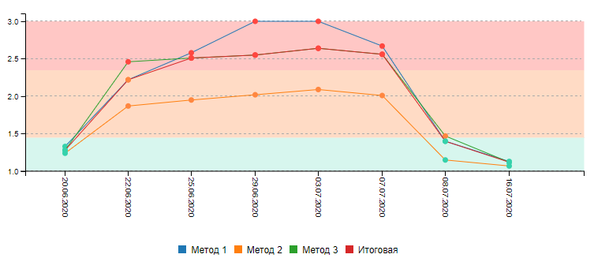

# Острый панкреатит

Данный проект направлен на демонстрацию некоторых этапов работы с данными по острому панкреатиту в ознакомительных целях.

Для работы с полноценным продуктом необходимо обратиться в компанию [ООО "Ар Ди Сайнс"](http://rd-science.ru/ru/).

## Заметки

В качестве итогового решения применяется метаклассификатор, использующий результаты нескольких моделей. 
В рамках ознакомления речь пойдёт об одной из данных моделей, созданной на базе SVM (точнее, SVR). Для данной
модели в качестве метрики был выбран [ROC-AUC](https://scikit-learn.org/stable/modules/generated/sklearn.metrics.roc_auc_score.html).

В процессе работы с данными периодически подгружались новые признаки, а также возникла необходимость чистки некоторых
объектов по заданой логике, определённой экспертом предметной области.
Поэтому связанность этапов в количестве и качестве данных периодически нарушалась.

Одним из ключевых свойств данной выборки был её малый объём.

## Визуализация (обработанных) данных

### t-SNE

### PCA на числовых признаках (абсолютная шкала)

## Предобработка признаков

В качестве предобработки признаков по итогу были выполнены следюущие действия:

* [минмаксная нормализация](https://scikit-learn.org/stable/modules/generated/sklearn.preprocessing.MinMaxScaler.html) числовых признаков;
* [квантильное преобразование в равномерное распределение](https://scikit-learn.org/stable/modules/generated/sklearn.preprocessing.QuantileTransformer.html) некоторых числовых признаков (специфика данных и экспертное мнение об отсутствии шумов в тех признаков, где при обычном анализе они бы были определены);
* приведение категориальных и номинальных признаков в числовой вид.

## Отбор признаков

Отбор признаков происходил методом прореживания, проверкой корреляции, а также просмотром распределений

### Корреляция (тепловая карта)

#### Числовые признаки, корреляция Пирсона

#### Ранговые признаки, корреляция Спирмена

### Метод прореживания

## Обучение

Выборка была разбита 10 тыс. раз на тестовую и обучающую. Обученные модели использовались для
прогноза тестовых данных, после чего производился расчёт точности на тесте. Полученные результаты
на первых прогонах отображались в виде гистограммы, далее бралось среднее.

### Пример гистограммы

## Визуализация распознавания (скользящий экзамен)

### Один против одного (OvO)

### Один против всех (OvR)

## Примеры работы

На приведённых ниже рисунках отображена динамика состояния пациента (прогнозов моделей) по ходу
получения новых результатов анализов.

### Пациент №1 (с осложнениями)

### Пациент №2

